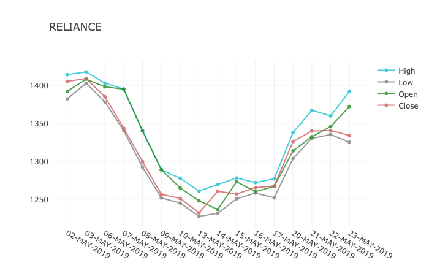

## Things completed as of now.

Consider this as **Documentation** as of now.

1. **getNSEDailyQuote** - Returns details for all the stock from the start and end date passed on as arguments from the NSEpy server.
- start_date : expects starting date of the detail you want to extract.
- end_date : expects ending date of the detail you want to extract.
- filename : expects the name of the file one wants.

---
2. **readNSEDailyQuote** - Returns data frame consisting detail of a particular script if name provided or returns the whole data frame from the provided start and end date.
- filename : expects the name of the file you want to read the data from.
- stock_name : expects the stock name whose info you want to find for a particular span of dates.
- series : By default is set as 'EQ', but can be overwritten by N1,N2,N3,N5 as per requirement.
- start_date : expects starting date of the detail you want to extract, by default set as None.
- end_date : expects ending date of the detail you want to extract, by default set as None.

---
3. **applyADX** - Returns Average Directional Movement Index of a particular script for anytime period passed.
- nsedailyquoteDF : expects a data frame having data of a particular script. For eg. data - returned from readNSEDailyQuote can be passed on to the above function to get the Average Directional Movement Index.

---
4. **applyADXR** - Returns Average Directional Movement Index Rating of a particular script for anytime period passed.
- nsedailyquoteDF : expects a data frame having data of a particular script. For eg. data returned from readNSEDailyQuote can be passed on to the above function to get the Average Directional Movement Index.

---
5. **applyAPO** - Returns Absolute Price Oscillator of a particular script for anytime period passed.
- nsedailyquoteDF : expects a data frame having data of a particular script. For eg. data returned from readNSEDailyQuote can be passed on to the above function to get the Average Directional Movement Index.

---
6. **applyAROONOSC** - Returns Aroon Oscillator of a particular script for anytime period passed.
- nsedailyquoteDF : expects a data frame having data of a particular script. For eg. data returned from readNSEDailyQuote can be passed on to the above function to get the Average Directional Movement Index.

---
7. **applyCCI** - Returns Commodity Channel Index of a particular script for anytime period passed.
- nsedailyquoteDF : expects a data frame having data of a particular script. For eg. data returned from readNSEDailyQuote can be passed on to the above function to get the Average Directional Movement Index.

---
Below is the ADX graph of SBIN for the period from 2-APR-2018 to 29-MAR-2019.

Below is the ADX graph of SBIN for the period from 2-APR-2018 to 29-MAR-2019 along with the high price for the same day.

---
Below is the OPEN, CLOSE, HIGH LOW data of Relaince and SBI from 1st May to 23rd May. I have created the graph as asked by Amit Sir.

